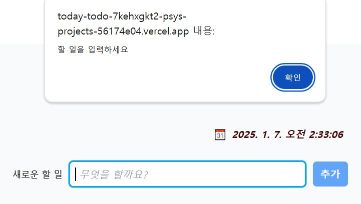
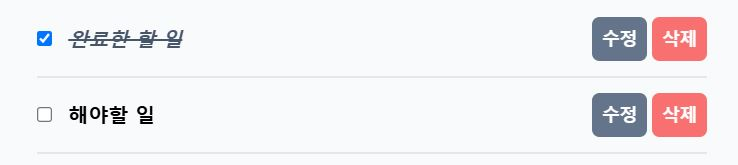

# ✔ 오늘의 할일 TodoList
 CRUD 기능과 함께 보다 나은 **사용자 편의**를 생각한 **ToDo App** 서비스입니다.    
 

 [ *🚀 구경가기*](https://today-todo-self.vercel.app/) 

   
   

      
      
## 1️⃣ 페이지별 구현 기능   

> ### header  

*  **현재 시간 확인**    
    *   useState를 사용하여 현재 시간을 저장해주고, setInterval함수를 사용하여 `매 초마다 새로운 시간을 set함수로 전달`하여 시간 state값을 업데이트 해줌

* **빈칸 입력 방지를 기능을 추가한 입력창**    
  * 빈 투두값을 입력할 때, `useRef( )`로 DOM에 접근하여 `input창을 focus`시키고, `css`를 통해 input창에 파란색 border를 주어 `사용자의 주의를 전환`시킴   
  
     
  * alert에 `경고메시지`를 주어 사용자가 빈 값을 입력하는 것을 방지
     

> ### Todo List   
*  **체크박스** 
   *  체크박스를 클릭했을 `css styling` *(line-through, italic, text-color)* 을 통해 완료한 투두임을 `구분` 함 
   

   

 * **수정기능** 
    *  수정 text임을 표시하기 위해  `css styling` *(text-color, italic)* 을 통한 기존 투두와의 `차별적 디자인 적용`   
    *  `수정버튼`을 통해 수정할 수 있는 기존 기능을 `문자열 창을 눌렀을 때도 수정`할 수 있도록 `기능 확대` 
    

  
 
* **삭제 기능**   
  * `filter( ) 함수`를 사용하여 클릭한 투두와 id 값이 다른 투두만 필터링해서 보여줌     

 

## 2️⃣ version2   
   
*  사용자 편의와 코드 간결성을 위해 수정   
    1. **간결한 코드 작성**을 위해 input창을 form 태그로 설정    
    2. **사용자 실수 방지**를 위해 useRef와 alert창을 이용해 주의 환기
    3. **사용자 편의**를 위한 기능 추가   
      ➡ 수정 버튼 기능을 확대하여 문자열 클릭시에도 수정창으로 변경  

 

## 3️⃣  트러블 슈팅
> ### 1. enter Key로 새 투두 입력시 중복 적용되는 문제 발생   
* **문제 배경**: form 태그로 리팩토링 하는 과정에서 문제 인지, enterKey로 새 투두 입력시 값이 2번 입력됨
* **해결 방법** : `onkeydown 이벤트 삭제`   
새 투두를 추가하는 `함수가 두 번 호출`되기 때문에 문제가 발생함. onkeydown 이벤트를 따로 처리하지 않아도 Enter 키를 누르면 onSubmit이 호출되기 때문에, 굳이 onkeydown 이벤트를 사용할 필요가 없다.    

> ### 2. 투두 입력후 input창에 값 비우기   
* **문제 배경**: form 태그 사용후 todo를 list에 추가한 후 상태를 업데이트하는 함수를 통해 값을 비워도 추가된 todo값이 input창에 그대로 남아있음 
* **해결 방법** : 
  * 상태를 업데이트 하는 함수를 사용하였지만, input의 value 속성은 명시하지 않았기 때문에 `입력 필드와 값이 상태와 동기화되지 않아서` 문제 발생
  *  `input의 value 속성`을 주어 `상태와 상태관리 함수를 동기화`시킴   

  
    

## 4️⃣ 기술 스택
* Module Bundler : vite-app
* Library : React
* language : html, css, TypeScript
* styling : tailwind   
* 상태관리 : zustand